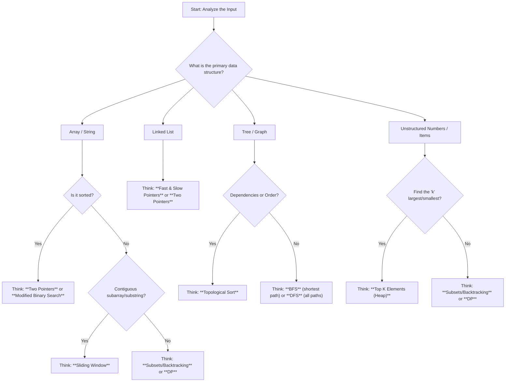

# The DSA Diagnostic Toolkit: A Cognitive Cheatsheet

Stop guessing. Start diagnosing. This guide emulates the mental flowchart of an experienced developer when faced with a new problem. Follow the steps to systematically identify the right pattern.

---

### **Step 1: The Initial Triage (A Mental Flowchart)**

Start at the top and answer the questions to get to a likely pattern category.

---

### **Step 2: The Detailed Diagnosis (The Pattern Matrix)**

Once the flowchart gives you a hint, use this matrix to confirm your diagnosis. Find the row that best describes your problem's **Goal** and check the columns for matching **Clues** and **Data Structures**.

| **Primary Goal of the Problem** | **Common Data Structure(s)** | **Key Clues & Keywords** | **Likely Pattern** |
| :--- | :--- | :--- | :--- |
| **Find the optimal (max/min) value of a CONTIGUOUS subarray/substring** | `Array`, `String` | `contiguous`, `longest`, `shortest`, `maximum sum`, `fixed size k` | ✅ **Sliding Window** |
| **Find a PAIR or TRIPLET in a SORTED array that meets a condition** | `Sorted Array` | `pair`, `triplet`, `target sum`, `squaring`, `remove duplicates` | ✅ **Two Pointers** |
| **Deal with CYCLES or find the MIDDLE of a Linked List** | `Linked List` | `cycle`, `middle node`, `k-th from end`, `palindrome` | ✅ **Fast & Slow Pointers** |
| **Find the SHORTEST PATH or process level-by-level** | `Tree`, `Graph` | `shortest path`, `minimum steps`, `level order`, `nearest` | ✅ **BFS** |
| **Explore ALL PATHS or check CONNECTIVITY** | `Tree`, `Graph` | `path exists?`, `all paths`, `connected components`, `permutations` | ✅ **DFS / Backtracking** |
| **Find the 'k' largest/smallest/most frequent items** | `Array`, `List` | `top k`, `k-th largest`, `k most frequent`, `k closest` | ✅ **Top K Elements (Heap)** |
| **Generate ALL POSSIBLE subsets, permutations, or combinations** | `Array`, `String`, `Set` | `all possible`, `generate all`, `find all combinations` | ✅ **Subsets / Backtracking** |
| **Find an optimal value or # of ways by breaking into smaller pieces** | `Array`, `String`, `Grid` | `max/min value`, `number of ways`, `longest common subsequence` | ✅ **Dynamic Programming** |
| **Find a valid ORDER based on PREREQUISITES or dependencies** | `Graph (DAG)` | `dependencies`, `prerequisites`, `course schedule`, `build order` | ✅ **Topological Sort** |
| **Search in a SORTED but ROTATED array** | `Rotated Sorted Array` | `rotated`, `peak element`, `find minimum` | ✅ **Modified Binary Search** |
| **Make the best immediate choice to find a global optimum** | `Array`, `Intervals` | `optimal`, `maximum`, `minimum`, `fewest` | ✅ **Greedy** |

### How to Use This Toolkit:

1.  **Read the problem statement carefully.**
2.  **Run it through the Flowchart (Step 1).** This gives you a quick, high-level direction. "Okay, it's an array problem, and it's about a contiguous subarray... I should probably think about Sliding Window."
3.  **Confirm with the Matrix (Step 2).** Look for the row that matches your goal. Check if the data structure and keywords align. "Yes, the goal is to find the max sum of a contiguous subarray. The clues match. It's definitely Sliding Window."
4.  **Proceed with confidence.** You've now diagnosed the problem, not just guessed.